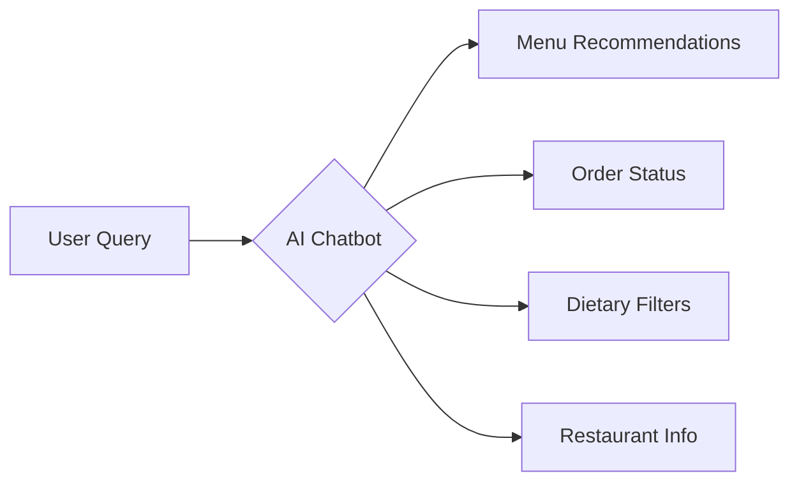

# 🍔 Yumzy - AI-Powered Food Delivery Platform

> **Bringing restaurant experiences to your doorstep with intelligent ordering assistance**

---

## 🌐 Live Demo

🔗 **[Try Yumzy Now!](https://yumzy-frontend-cmii.onrender.com/)**

---

## ✨ Features at a Glance

- 🤖 **AI Chatbot Assistant** – Smart food suggestions & order help  
- 🛒 **Seamless Ordering** – Browse menus, customize dishes, quick checkout  
- 🔐 **Secure Authentication** – JWT-based login and signup  
- 📊 **Admin Dashboard** – Manage inventory, orders, and analytics  
- 📱 **Responsive UI** – Mobile-first, works beautifully on all screens  
- 🐳 **Dockerized Deployment** – Easy local setup and scalable hosting  

---

## 🤖 AI Chatbot Capabilities

What the chatbot can do:

- 🍽️ Recommend food in real time

- 🔍 Check order status

- 🧬 Filter by allergies or dietary preferences

- 🕐 Provide restaurant timings & location info

- ❓ Instantly answer FAQs

## 🛠 Tech Stack

| Layer    | Technologies                           |
| -------- | -------------------------------------- |
| Frontend | React, Tailwind CSS, Context API       |
| Backend  | Node.js, Express.js, MongoDB, Mongoose |
| AI       | Custom NLP-based Chatbot               |
| DevOps   | Docker, Render.com                     |

## 📁 Project Structure

    yumzy/
    ├── docker-compose.yml       # Docker config
    ├── admin/                   # Admin dashboard (React)
    ├── backend/                 # API service (Node/Express)
    │   ├── controllers/         # Business logic
    │   ├── models/              # MongoDB schemas
    │   ├── routes/              # API endpoints
    │   └── uploads/             # Uploaded images
    └── frontend/                # Customer UI (React)
         ├── components/          # Reusable components (e.g., Chatbot)
         ├── context/             # Global state management
         ├── pages/               # Views and routes
         └── assets/              # Static files (images, icons, etc.)

## 🚀 Getting Started

## 📦 Prerequisites
-Node.js (v16+)

-MongoDB

-Docker (optional)

## 🔧 Installation

# Clone repository
git clone https://github.com/your-username/yumzy.git

cd yumzy

# Install dependencies
npm run setup

# Start development servers
npm run dev

# Or run with Docker
docker-compose up --build

# 🔌 API Endpoints

| Endpoint             | Method | Description            |
| -------------------- | ------ | ---------------------- |
| `/api/ai/chat`       | POST   | Chatbot query handling |
| `/api/user/login`    | POST   | User login             |
| `/api/food`          | GET    | Fetch food menu        |
| `/api/cart/add`      | POST   | Add item to cart       |
| `/api/order/history` | GET    | Fetch past orders      |

## 🔮 Future Roadmap

-🗺️ Real-Time Order Tracking

-⭐ User Ratings & Reviews

-🧠 Smarter AI with User Preferences

-📈 Admin Sales Analytics

## 🤝 Contributing
We welcome contributions! Here's how:

1 Fork the repo

2 Create your feature branch
  git checkout -b feature/amazing-feature

3 Commit your changes
  git commit -m 'Add amazing feature'

4 Push to GitHub
  git push origin feature/amazing-feature

5 Open a Pull Request

