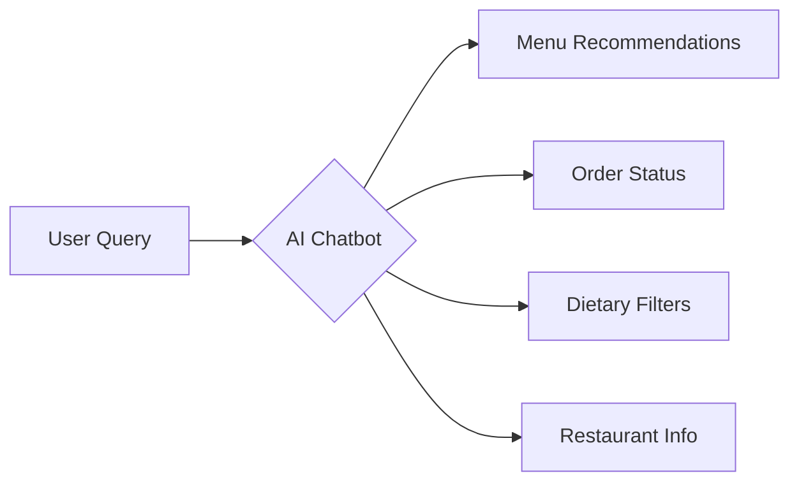

# 🍔 Yumzy - Premium AI-Powered Food Delivery Platform


> **Bringing world-class restaurant experiences to your doorstep with intelligent ordering assistance and a luxury user interface.**

Yumzy is a state-of-the-art, full-stack food delivery web application built with the MERN stack (MongoDB, Express, React, Node.js). Designed with a premium, dynamic, and fully responsive user interface, Yumzy brings the luxury restaurant experience straight to your screen.

---

## 🌐 Live Demo

🔗 **[Try Yumzy Now!](https://yumzy-frontend-cmii.onrender.com/)**

---

## ✨ Features at a Glance

- 🎨 **Premium UI/UX Redesign** – "Uber Eats meets Apple" aesthetics with glassmorphism, fluid Framer Motion animations, and beautiful typography (Outfit & Inter fonts).
- 🤖 **AI Chatbot Assistant** – Smart food suggestions & order help.
- 🛒 **Seamless Ordering** – Browse menus, customize dishes, quick checkout with luxury input fields.
- 🔐 **Secure Authentication** – JWT-based login and signup.
- 📊 **Admin Dashboard** – Manage inventory, orders, and analytics.
- 📱 **Responsive UI** – Mobile-first, works beautifully on all screens.
- 🐳 **Dockerized Deployment** – Easy local setup and scalable hosting.

---

## 🤖 AI Chatbot Capabilities


```mermaid
graph LR
    A[User Query] --> B{AI Chatbot}
    B --> C[Menu Recommendations]
    B --> D[Order Status]
    B --> E[Dietary Filters]
    B --> F[Restaurant Info]
```

What the chatbot can do:
- 🍽️ Recommend food in real time
- 🔍 Check order status
- 🧬 Filter by allergies or dietary preferences
- 🕐 Provide restaurant timings & location info
- ❓ Instantly answer FAQs

## 🛠 Tech Stack

| Layer    | Technologies                           |
| -------- | -------------------------------------- |
| Frontend | React, Tailwind CSS, Framer Motion     |
| Backend  | Node.js, Express.js, MongoDB, Mongoose |
| AI       | Custom NLP-based Chatbot               |
| DevOps   | Docker, Render.com                     |

## 📁 Project Structure

    yumzy/
    ├── docker-compose.yml       # Docker config
    ├── admin/                   # Admin dashboard (React)
    ├── backend/                 # API service (Node/Express)
    │   ├── controllers/         # Business logic
    │   ├── models/              # MongoDB schemas
    │   ├── routes/              # API endpoints
    │   └── uploads/             # Uploaded images
    └── frontend/                # Customer UI (React)
         ├── components/          # Reusable components (e.g., Chatbot)
         ├── context/             # Global state management
         ├── pages/               # Views and routes
         └── assets/              # Static files (images, icons, etc.)

## 🚀 Getting Started

### 📦 Prerequisites
- Node.js (v16+)
- MongoDB
- Docker (optional)

### 🔧 Installation

```bash
# Clone repository
git clone https://github.com/aassiiss/Yumzy.git

cd Yumzy

# Install dependencies for both frontend and backend
# (Ensure to run npm install in respective directories)

# Start backend server
cd backend
npm install
npm run dev
```

### 3. Setup the Frontend
```bash
cd ../frontend
npm install
npm run dev
```
The app will be running at `http://localhost:5173`.

### 4. Setup the Admin Panel
```bash
cd ../admin
npm install
npm run dev
```
The admin panel will be running at `http://localhost:5174`.

## 📦 Database Seeding
To quickly populate your local database with high-quality, pre-configured dishes and images, run:
```bash
cd backend
node seed_local_existing.js
```

### 🔌 API Endpoints

| Endpoint             | Method | Description            |
| -------------------- | ------ | ---------------------- |
| `/api/ai/chat`       | POST   | Chatbot query handling |
| `/api/user/login`    | POST   | User login             |
| `/api/food`          | GET    | Fetch food menu        |
| `/api/cart/add`      | POST   | Add item to cart       |
| `/api/order/history` | GET    | Fetch past orders      |


## 🔮 Future Roadmap

- 🗺️ Real-Time Order Tracking
- ⭐ User Ratings & Reviews
- 🧠 Smarter AI with User Preferences
- 📈 Admin Sales Analytics

## 🤝 Contributing
We welcome contributions! Here's how:

1. Fork the repo
2. Create your feature branch (`git checkout -b feature/amazing-feature`)
3. Commit your changes (`git commit -m 'Add amazing feature'`)
4. Push to GitHub (`git push origin feature/amazing-feature`)
5. Open a Pull Request

## 📜 License
This project is licensed under the MIT License.
